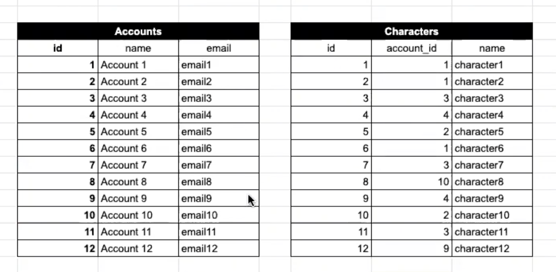
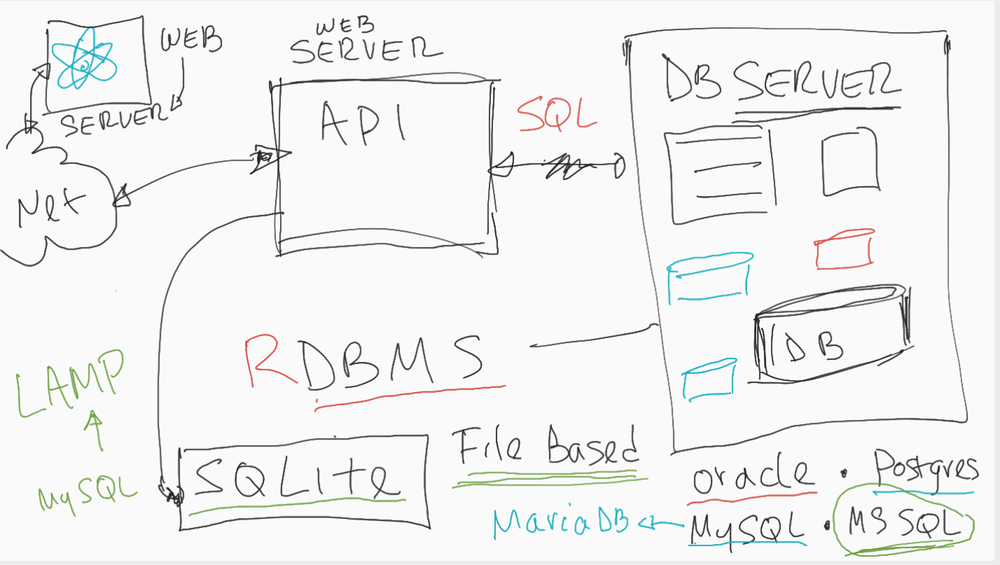
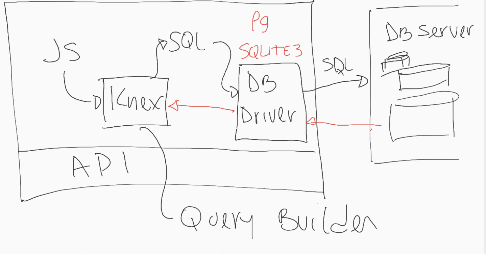

# Intro to Relational Databases

Training Kit

<https://learn.lambdaschool.com/web4node/module/recFG7SqlSCAB8iU7>

Lecture on YouTube

<https://www.youtube.com/watch?v=7Tg_v7dHzqU&feature=youtu.be>

## Relational Databases Intro

[ 7:00 - 14:00 ]

:question: What is a relational data base? :question:

- container holds all of the data
  - data is organized in table(s)
  - data is optimized for easy retrieval later
    - table(s) are super-duper organized
    - them easy to _query_
- relation ... so everything is related?
  - not exactly..._relation_ is a math thing
  - organized like freaking accountant organize data
- data inside relational database is stored in tables



## SQL

[ 14:00 - 16:00 ]

Structured Query Language

- designed originally to read like english
- allows us to communicate with databases
- 4 critical SQL commands
  1. SELECT
  2. INSERT
  3. UPDATE
  4. DELETE

:question: Do we deal with the server directly? :question:

- NO...we talk to the database _server_
- database server handles way more than just data
  - security

Databases

- server based
  - Oracle
  - MySQL -> MariaDB
  - Postgres
  - MS SQL
- file based
  - SQLite

### SQLite

[ 16:00 ]

- Practice using the site below
- <https://www.w3schools.com/Sql/trysql.asp?filename=trysql_select_all>

#### Selecting Data

:question: How do we query for data? :question:

```SQL
--  list of all products
SELECT * FROM PRODUCTS;
```

```SQL
--  list of all products (but more specific)
select productId, productName from products;
```

- :eyes: notice :eyes:
  - SELECT & select ...
  - capitalization is not necessary but was best practice before text editors had such great color coded syntax

```SQL
--  list of all products
select * from [from]:
```

- :exclamation: do not do this :exclamation:

  - brackets are a way for you to use invalid names for objects
    - why would you have object named 'from'? `¯\_(ツ)_/¯`
  - if you find yourself using [some name]
    - rename the 'some name' to something valid

- :question: can i multiple queries at once :question:
  - not in the SQLite W3Schools tool
  - MySQL and other GUI's allow you to do this

```SQL
--  list of all products (but more specific)
--  reorder the results
select ProductName, Price, Unit
from products;
```

- [ 32:00 ]
- we set the order of results when making a query
  - `select order, of, results, desired`
- multiline queries are ended with a `;`

#### Filtering

:question: How would we filter our results? :question:

[ 33:00 ]

```SQL
--  list of all customers in the UK
in the UK
select *
from customers
where country = 'UK';  --
```

- `where` comparison
  - just a normal comparison operation like one used in any other programming language
    - some comparisons specific to SQL
    - all mathematical operations are there
    - can use parentheses
- :exclamation: notice :exclamation:
  - dates and strings are wrapped in `'single quotes'`
  - this database tool is case sensitive
    - typically, we would try to avoid this

Let's get more specific ...

```SQL
--  all products with price greater than $5.00
select *
from products
where price < 5
```

```SQL
--  all customers in UK (country) or Berlin (city)
SELECT *
FROM customers
WHERE Country='UK' or City='Berlin';
```

```SQL
--  all customers from the UK and USA
SELECT *
FROM customers
WHERE Country='UK' or Country="USA";
```

```SQL
--  all customers from the UK and USA
select *
from customers
where country IN ('UK', 'USA')
```

```SQL
--  all customers from the UK and USA
select *
from customers
where country not in ('UK', 'USA')
```

- `>` : all the mathematical operators you'd expect
- `or` : where country is this _or_ that?
- `in` : where countries are included _in_ this object?
  - `not in` : excludes results

```SQL
--  all customers sorted by country then city
--  + all the other info
select country, city, * from customers;
```

- `*` : all of the rest
  - select country, name, **everything else** from customers

:question: How could we make this look nicer? :question:

[ 46:00 ]

```SQL
--  all customers sorted by country then city
--  sorted by country, city ... then name
--  in descending order
select country, city, *
from customers
order by country desc, city, customerName
```

- `order by`
- `desc` : how we sort things in descending order
  - ascending by default (numbers & strings)

```SQL
-- 5 cheapest products
select *
from products
order by price
limit 5;
```

- `limit` : standard in most open source databases
- `top` : you may see this (not in SQLite)

```SQL
-- 5 most expensive products
select *
from products
order by price desc
limit 5;
```

- larger numbers are at top so we use `desc`

#### Adding Data

[ 55:00 ]

```SQL
--  add a new shipping company
insert into shippers(phone, shipperName)
values ('(502)555-1234', 'My Shipping Co.')
--  [returns] 'Changes made to the database: 1'
```

```SQL
--  add two new shipping companies
insert into shippers(phone, shipperName)
values (
  '(502)555-1234', 'My Shipping Co.',
  '(555)555-5555', 'My Co.'
  )
--  [returns] 'Changes made to the database: 2'
```

- `insert` :
  - can be written a few different ways
  - values must follow identifier values order
- can add more than one thing at a time

#### Updating Data

[ 1:00 ]

```SQL
--  fix the errors
--    1.  shipping company #4 name is wrong
--    2.  SAME shipping company phone should be '(555)555-1234'
update shippers
set
  shipperName = 'lambda shipping',
  Phone = '(555)555-1234'
where shipperId = 4;
```

- :construction: WARNING :construction:
  - forgetting the `where` statement or using the wrong one will overwrite `EVERYTHING` or `THE_WRONG_THING`
  - what to do next???
    - pack your things
    - get fired :put_litter_in_its_place:
  - typically, test where condition with a select first
    - test many times on database copies [ 1:03 ]

#### Deleting Data

[ 1:11:30 ]

```SQL
--  delete shipper (5)
delete from shippers
where shipperId = 4;
--  [returns] 'Changes were made oto the database.'
```

- :construction: WARNING :construction:
  - DON'T DELETE THE WRONG SHIT

## Connecting JavaScript to SQL

- JavaScript we write doesn't speak the same language as SQL
- use a query builder to do the translation

### Knex.js

[ 1:15 ]



- api doesn't actually talk to SQL



- query builder is used to turn JS in SQL

<http://knexjs.org/>

- power of a Knex query builder:
  - knows differences between databases
  - this is beautiful b/c we don't have to remember this

:question: How does Knex know which database language to translate to? :question:

- specify a database driver as a seed (DB Driver in photo #2)
- needs to know username and password (for server based databases)
- SQLite is file based so it just needs to know the file to look at

:exclamation: not setting up driver / configuration today :exclamation:

- [ 1:27 ]
- check it out:
  - `db-config.js`
  - `knexfile.js`

## Finishing the Guided Project

[ 1:29 ]

install necessary dependencies

1. `npm i` : everything in package.json already
2. `npm i knex sqlite3` : add to package.json

start the server

- `npm run server`

Complete post-router.js

- add code accordingly
- see [post-router.js](/posts/post-router.js)
